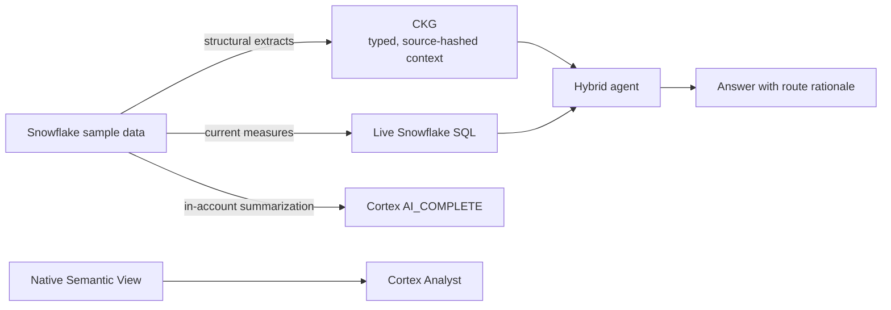

# Snowflake × Cortex Context Engineering

[](https://yarmoluk.github.io/ckg-snowflake-hybrid-demo/)
[](https://github.com/Yarmoluk/ckg-snowflake-hybrid-demo)
[](https://www.python.org/)


An independent, runnable reference implementation for one practical agent pattern: **use source-backed graph context for stable relationships, Snowflake for current measures, and a governed Semantic View for Analyst-generated SQL.**

**[Open the public documentation site →](https://yarmoluk.github.io/ckg-snowflake-hybrid-demo/)**

## What this demonstrates

| Need | Implementation | Why it matters |
| --- | --- | --- |
| Stable structural context | A 41-node CKG built from TPC-H query results | An agent can inspect regions, segments, supplier structure, and priorities without re-querying the warehouse. |
| Current values | Live Snowflake SQL | Revenue and order counts stay fresh rather than becoming cached graph facts. |
| Governed natural-language SQL | Native Snowflake Semantic View | Logical tables, joins, dimensions, metrics, synonyms, and generation guidance form an Analyst-ready business layer. |
| In-account summarization | Cortex `AI_COMPLETE` | Query results can be summarized inside the Snowflake environment. |

The useful design decision is the boundary, not the graph alone:

```text
“Which customer segments exist?”
  → CKG (stable context)

“Which region has the most orders?”
  → live Snowflake SQL (current measure)

“Which region has the most orders, and what segments exist there?”
  → both
```

## Explore it

- [Documentation site](https://yarmoluk.github.io/ckg-snowflake-hybrid-demo/): architecture, runbook, Semantic View explanation, and claim-safe interview brief.
- [`web/main.html`](web/main.html): interactive explorer for the checked-in commerce CKG.
- [`web/clinical-trials.html`](web/clinical-trials.html): selected public ClinicalTrials.gov records shown as a context graph for regulated-domain architecture discussion.
- [`sql/03_cortex_analyst_semantic_view.sql`](sql/03_cortex_analyst_semantic_view.sql): native Semantic View DDL.
- [`sql/04_semantic_view_checks.sql`](sql/04_semantic_view_checks.sql): Semantic View inspection and governed Semantic SQL checks.

## Architecture



The direct-tool-use agent in `src/agent.py` can choose CKG retrieval, live Snowflake SQL, or both. `src/compress_to_ckg.py` generates the graph from structural query results; each non-root node has a SHA-256 anchor for the exact result set that created it.

## Run it

### Snowflake setup

In Snowsight, run these in order:

```text
sql/01_setup.sql
sql/02_sample_queries.sql
sql/03_cortex_analyst_semantic_view.sql
sql/04_semantic_view_checks.sql
```

The demo assumes access to `SNOWFLAKE_SAMPLE_DATA.TPCH_SF1`. If your account exposes different Cortex models, update the model name in the sample configuration before using `AI_COMPLETE`.

### Python agent

```bash
git clone https://github.com/Yarmoluk/ckg-snowflake-hybrid-demo.git
cd ckg-snowflake-hybrid-demo
python3 -m venv .venv
source .venv/bin/activate
pip install -r requirements.txt
cp .env.example .env
# Add Snowflake credentials and ANTHROPIC_API_KEY.
python -m demo.run_demo
```

### Interactive explorer

```bash
python3 -m http.server 8000
# Open http://localhost:8000/web/main.html
```

The browser explorer is a transparent client-side routing demonstration; it does not execute warehouse SQL or call an LLM.

## Build the documentation site

```bash
pip install -r requirements-docs.txt
mkdocs serve
```

Pushes to `main` build and deploy the site with GitHub Actions and GitHub Pages.

## Project layout

```text
ckg/       Checked-in compact knowledge graph artifact
sql/       Snowflake setup, sample queries, Semantic View, and validation SQL
src/       Extractor, graph retrieval, Cortex client, and hybrid agent
web/       Standalone interactive graph explorers
docs/      Public MkDocs Material documentation site
```

## Scope and claim boundaries

This is a self-directed, open-source proof of concept. It is not client work, an MCP service, a production deployment, or a claim of completed Cortex Analyst delivery. The Semantic View is an executable native implementation that must be validated in the intended Snowflake account before it is described as live.

The clinical companion uses selected public ClinicalTrials.gov records. It is not medical advice, an efficacy claim, a live trial finder, or a complete sponsor portfolio.

“Snowflake” and “Cortex” are used to identify the technologies demonstrated. This independent project is not affiliated with or endorsed by Snowflake.
