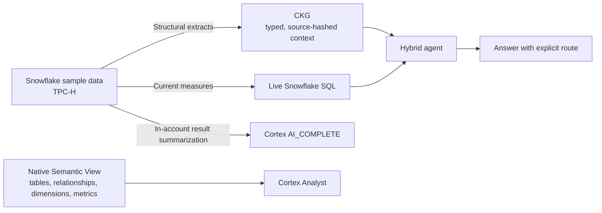

# Architecture

The system does not treat every question as a warehouse query or every question as a graph lookup. It gives the agent both paths and makes their tradeoff visible.

## The context split

| Layer | Stores | Does not store | Why |
| --- | --- | --- | --- |
| CKG | Stable business entities and relationships | Revenue and current order counts | Avoids stale cached measures and unnecessary warehouse access. |
| Snowflake | Current operational measures | A precomputed graph answer | Keeps values governed and fresh at query time. |
| Semantic View | Business definitions for Analyst-generated SQL | An alternative graph format | Gives Cortex Analyst logical tables, joins, dimensions, metrics, and instructions. |

## Provenance

`src/compress_to_ckg.py` executes structural queries and writes nodes to `ckg/ecommerce-tpch.csv`. Each non-root node retains a SHA-256 hash of the exact query result used to create it. Re-running the extraction gives a direct way to detect whether its source result moved.

That provenance anchor is deliberately different from the live path: a graph node can explain its structural source, while a question about a current measure must use live Snowflake SQL.

## Two model access paths

The demo intentionally distinguishes:

- `AI_COMPLETE(...)` through Snowflake Cortex: result summarization inside the Snowflake environment.
- Direct Anthropic tool use in `src/agent.py`: an orchestrator that can choose CKG retrieval, live Snowflake SQL, or both.

This makes the routing policy inspectable in source code. It does not claim that the demo uses Snowflake Cortex Agents or that it is a production orchestration pattern.
