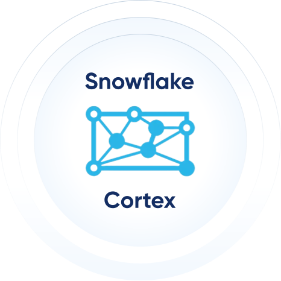

  

    

      
      
Independent reference implementation

      <h1>Context engineering for Snowflake + Cortex agents</h1>
      
A runnable pattern for agents that need two forms of truth: provenance-backed structural context and live warehouse measures.

      

        <a class="md-button md-button--primary" href="explorer/index.md">Explore the hybrid graph</a>
        <a class="md-button" href="semantic-view/">Inspect the semantic view</a>
      

    

    
  

This project demonstrates a practical decision boundary: use a compact knowledge graph (CKG) for stable, typed relationships; use Snowflake for measures that can change; combine them when a question needs both.

### Stable context → CKG

Regions, customer segments, supplier structure, and fulfillment priorities become typed nodes with source-query hashes.

### Current measures → Snowflake

Revenue, counts, and other time-sensitive values stay in the warehouse and are fetched live.

### Governed SQL → Cortex Analyst

A native Semantic View models logical tables, joins, dimensions, metrics, synonyms, and generation guidance.

## See the decision boundary

| Question | Correct route | Why |
| --- | --- | --- |
| “Which customer segments exist?” | CKG | It is stable structural context. |
| “Which region has the most orders?” | Live Snowflake SQL | The metric can change. |
| “Which region has the most orders, and what segments exist there?” | Both | It needs a current measure and durable context. |

[:octicons-play-16: Open the interactive explorer](explorer/index.md){ .md-button .md-button--primary }
[:octicons-mark-github-16: View source](https://github.com/Yarmoluk/ckg-snowflake-hybrid-demo){ .md-button }

## What is included

- A Python hybrid agent with explicit CKG and live-Snowflake tools.
- A 41-node CKG generated from Snowflake TPC-H structural query results.
- Source-result SHA-256 anchors for non-root graph nodes.
- A Cortex `AI_COMPLETE` example for in-account result summarization.
- A native, governed Snowflake Semantic View and verification script.
- Two browser-based context explorers: TPC-H commerce and selected public clinical-trial records.

!!! note "Scope and verification"
    This is a self-directed, open-source proof of concept. It is not a client deployment or a production system. The Semantic View is checked in as executable Snowflake DDL; it should be run and validated in the target Snowflake account before presenting it as live Cortex Analyst delivery.

“Snowflake” and “Cortex” are used here to identify the technologies demonstrated. This independent project is not affiliated with or endorsed by Snowflake.

